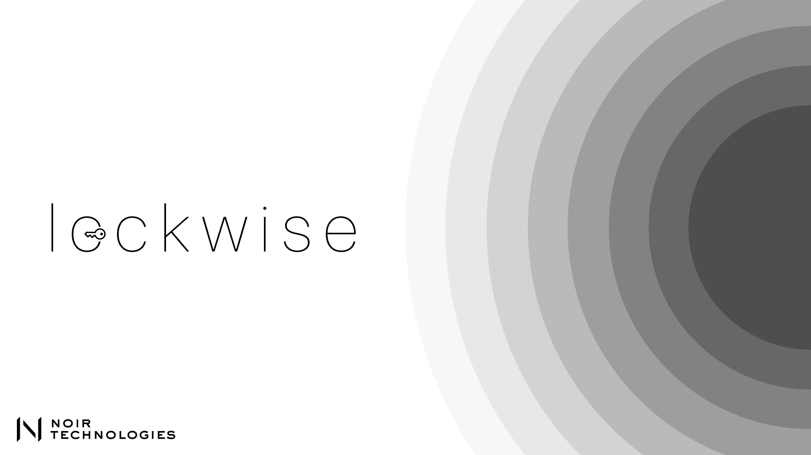

# Lockwise

Lockwise is an innovative smart lock system developed by NOIR Technologies. This project integrates RFID-based access control with facial recognition to provide a secure and user-friendly entry system. The system is designed to prioritize RFID access as a backup mechanism, ensuring reliable operation even if the facial recognition system encounters issues. Lockwise is a robust solution aimed at enhancing security and convenience in both residential and commercial settings.

## Table of Contents

-   [Introduction](#introduction)
-   [Features](#features)
-   [Project Structure](#project-structure)
-   [Installation](#installation)
-   [Usage](#usage)
-   [Hardware Requirements](#hardware-requirements)
-   [Software Requirements](#software-requirements)
-   [License](#license)
-   [Acknowledgments](#acknowledgments)

## Introduction

Lockwise combines RFID and facial recognition technologies to create a seamless and secure locking mechanism. Developed with CircuitPython for the IdeaBoard, this system provides both local and remote control capabilities. It is ideal for smart homes, offices, or any environment that requires advanced access control solutions.

## Features

-   **Dual Access Control**: Utilizes both RFID and facial recognition for secure entry.
-   **Wi-Fi Connectivity**: Remote control via HTTP requests.
-   **Priority System**: RFID access serves as a backup when facial recognition is unavailable.
-   **Real-time Monitoring**: Immediate feedback with LED indicators for lock status.
-   **Modular Design**: Easily customizable for various use cases.

## Project Structure

```
Lockwise/
├── controller.py       # Handles HTTP requests from the computer to the IdeaBoard
├── datacollect.py      # Collects facial data for training the recognition model
├── trainmodel.py       # Trains the facial recognition model using collected data
├── testmodel.py        # Facial recognition script running on the computer
├── main.py             # Main script running on the IdeaBoard, manages RFID and server
├── requirements.txt    # Python dependencies for the computer
├── README.md           # Project documentation
└── images/             # Photographs and design images
```

## Installation

### Hardware Setup

1. **RFID Reader**: Connect the RFID reader to the IdeaBoard as per the wiring diagram.
2. **IdeaBoard**: Flash CircuitPython onto the IdeaBoard and upload the necessary scripts.
3. **Servo Motor**: Connect the servo motor to the specified PWM pin on the IdeaBoard.

### Software Setup

1. Clone this repository:
    ```bash
    git clone https://github.com/noirtech/lockwise.git
    ```
2. Install the required Python libraries on your computer:
    ```bash
    pip install -r requirements.txt
    ```
3. Modify the `controller.py` file with the correct IP address for the IdeaBoard.

## Usage

### Running the System

1. Power on the IdeaBoard and connect it to Wi-Fi.
2. Start the facial recognition script on your computer:
    ```bash
    python testmodel.py
    ```
3. Control the lock using facial recognition or RFID tags.

### Debugging

-   To troubleshoot RFID issues, ensure all connections are secure and check the serial output for detailed debug information.

## Hardware Requirements

-   IdeaBoard with CircuitPython
-   MFRC522 RFID Reader
-   Servo Motor
-   Computer for facial recognition processing

## Software Requirements

-   CircuitPython on IdeaBoard
-   Python 3.8+ on computer
-   OpenCV for facial recognition
-   Adafruit CircuitPython libraries for Wi-Fi and Servo control

## License

This project is licensed under the MIT License - see the [LICENSE](LICENSE) file for details.

## Acknowledgments

-   Special thanks to the team at NOIR Technologies for their continued support and innovation.
-   Developed as part of the ExpoCenfo 2024 competition.
